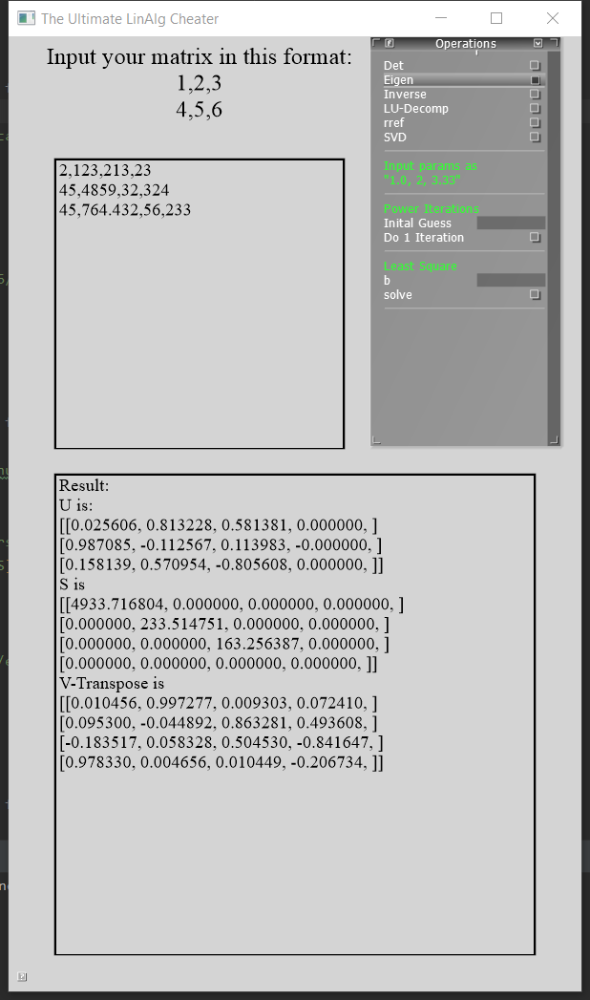

# Linear Algebra Cheater

[](LICENSE)
[](docs/README.md)

**Author**: Yihong Jian - [`yihongj2@illinois.edu`](mailto:yihongj2@illinois.edu)

This is a C++ program that performs basic linear algebra operations. It was developed as an effort to not do [CS357](https://courses.grainger.illinois.edu/cs357/sp2020/) homework by hand.  It currently supports calculation of following

- Determinant
- Eigenvalue and Eigenvectors
- LU Decomposition
- Linear Least Square
- Matrix Inverse
- Power Iteration
- Reduced Row Echelon Form
- Singular Value Decomposition

## Dependencies

The project is developed with CLion and compiled with MSVC on a Windows Machine. Unix support is not tested

#### Toolchain

- [MSVC 2019](https://visualstudio.microsoft.com/vs/) The compiler that was used to compile this app
- [CMake](https://cmake.org/)

#### Library

- [Cinder 0.9.3dev](https://github.com/cinder/Cinder) Will probably work with 0.9.2, but 0.9.2 does not support compiling with MSVC2019.
- [NumCpp](https://github.com/dpilger26/NumCpp) A c++ wrapper for numpy matrix operations
  - Note that it requires [boost 1.68/1.70](https://www.boost.org/)
- [Eigen 3.3.7](http://eigen.tuxfamily.org/index.php?title=Main_Page)

## Quick Start

1. Download and compile Cinder framework (either pre-packaged from website or clone its repository)
2. Make a new folder inside Cinder folder, e.g. ```Cinder\math_cheater```
3. Clone this repository into that folder
4. Update ```line 103``` of the ```CMakeList.txt``` to **your boost directory**
5. CMake should take care of other libraries.

## Usage



Simply enter your matrix with the following form then choose what kind of mathematic operation to perform on the right. Note that some operation only works for square matrices, like determinant, LU.

```
"
1,233.666,0.00098
12,213,435
213,998,666.098
12,1234,5678
"
```

## Further Development

- Some function are still kind of naive, for instance the determinant function only works for matrix smaller than 3*3. I'll probably rewrite a determinant function instead of using packaged ones.
- Add support for nonlinear solve(bisection, golden section, newton).
- Remove usage of numcpp, it's not really necessary given the usage of eigen.

## Support

- I'm open to any contribution to this project, just push to a new branch and open pull requests.
- Follow my [website](**https://yihjian.github.io/about/**) for more about me.